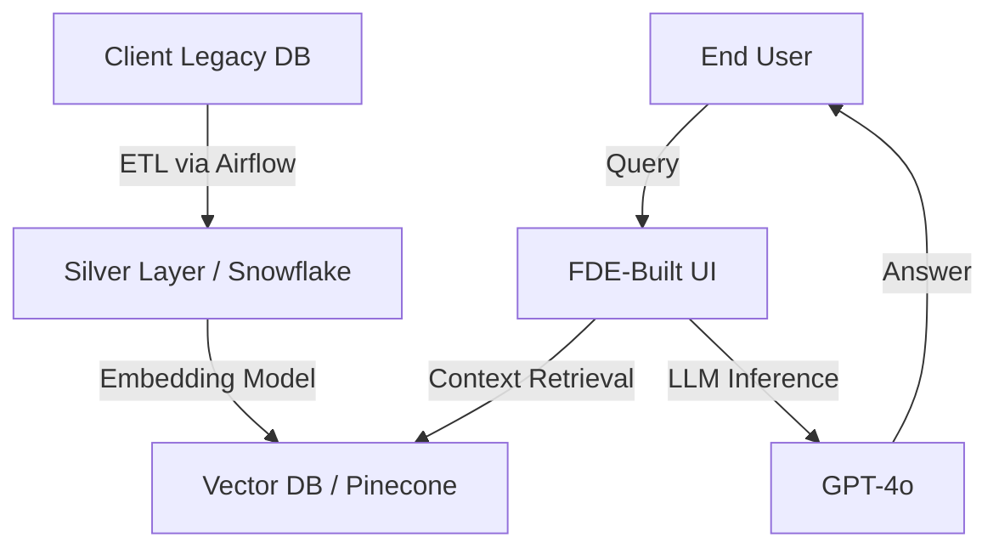

# 🚀 Awesome Forward Deployment Engineering (FDE)

[](https://awesome.re)
[]()
[]()

Forward Deployment Engineering is the art of shipping complex software where it matters most. It is a hybrid role—part **Software Engineer**, part **Data Architect**, and part **Strategic Consultant**. 

FDEs are the "Technical Special Ops" who bridge the gap (The Delta) between a core product and a client’s messy, real-world reality.

---

## 📑 Table of Contents
1. [**The FDE Persona & Mission**](#-the-fde-persona--mission)
2. [**The Master Curriculum**](#-the-master-curriculum)
3. [**The FDE Technical Library (Blogs & Deep Dives)**](#-the-fde-technical-library)
4. [**Applied AI & LLM Deployment (The 2026 Standard)**](#-applied-ai--llm-deployment)
5. [**The "Soft Stack": Consulting & Strategy**](#-the-soft-stack-consulting--strategy)
6. [**The Interview Blackbook & Case Studies**](#-the-interview-blackbook--case-studies)
7. [**Artifact Templates (Copy-Paste)**](#-artifact-templates-copy-paste)
8. [**Comprehensive Reading List**](#-comprehensive-reading-list)

---

## 🛸 The FDE Persona & Mission
The FDE is the **bridge** between the "Perfect Code" of HQ and the "Messy Reality" of the Client.

*   **The Problem:** Standard software often fails when it hits real-world data (corrupt schemas, air-gapped servers, political resistance).
*   **The Solution:** The FDE. They don't just "fix bugs"—they architect solutions, manage stakeholders, and write the "glue code" that makes a multi-million dollar contract successful.

In traditional Software Engineering (SWE), you build for a "user persona." In FDE, you build for a **mission**.

| Feature | Software Engineer (SWE) | Forward Deployed Engineer (FDE) |
| :--- | :--- | :--- |
| **User** | Millions of anonymous users | High-stakes stakeholders (CTOs, Generals, CEOs) |
| **Environment** | Controlled, uniform cloud | Hostile, legacy, air-gapped, or hybrid infra |
| **Goal** | Scale and stability | Speed-to-value and problem-solving |
| **Code Ratio** | 90% Features | 50% Integration/Glue, 50% Strategy |

### 🛠 The Modern FDE Stack

#### Core Tools
*   **Languages:** `Python` (Data/AI), `Go` (Infra), `SQL` (Everything).
*   **Data:** `dbt` (Transformation), `DuckDB` (Local processing), `Apache Spark`.
*   **Cloud:** `Terraform` (IaC), `Helm` (K8s packaging).
*   **Observability:** `Prometheus`, `Grafana`, `Loki`.

---

## 🎓 The Master Curriculum

### Phase 1: Data Engineering (The Foundation)
You cannot be an FDE if you cannot move and clean data.
*   **SQL Mastery:** Beyond `JOINs`. You must master Window Functions, Recursive CTEs, and Query Optimization.
*   **Data Modeling:** Understand **Star Schema** vs. **One Big Table (OBT)**. Know when to use **Normalization** vs. **Denormalization**.
*   **The Medallion Architecture:**
    *   **Bronze:** Raw landing zone.
    *   **Silver:** Filtered, joined, and cleaned.
    *   **Gold:** Business-ready aggregates.
*   **Distributed Computing:** Understand how **Spark** partitions data and how to debug a "Skewed Join."

#### Resources
*   **[The Data Engineering Cookbook](https://github.com/andkret/Cookbook):** A massive resource for everything data.
*   **[Medallion Architecture](https://www.databricks.com/glossary/medallion-architecture):** Learn how to structure Bronze, Silver, and Gold data layers.
*   **[Modern Data Stack (MDS)](https://blog.getdbt.com/what-is-the-modern-data-stack/):** Understanding the ecosystem (dbt, Fivetran, Snowflake).
*   **[Incremental Modeling](https://docs.getdbt.com/docs/build/incremental-models):** Crucial for handling massive datasets efficiently.

### Phase 2: Systems & Infrastructure
FDEs often have to "drop" software into an environment they don't control.
*   **Networking:** CIDR blocks, VPC Peering, Subnets, and SSL/TLS Handshakes.
*   **Containers:** Don't just "use" Docker. Understand **Layer Caching**, **Multi-stage builds**, and **Kubernetes Sidecars**.
*   **Security:** How to implement **OIDC/SAML** authentication and manage secrets in a high-security environment.

#### Resources
*   **[Kubernetes The Hard Way](https://github.com/kelseyhightower/kubernetes-the-hard-way):** Essential for understanding how to deploy in restricted environments.
*   **[The System Design Primer](https://github.com/donnemartin/system-design-primer):** The gold standard for architecting scalable systems.
*   **[Cloud Networking Basics](https://aws.amazon.com/blogs/networking-and-content-delivery/vpc-peering-vs-transit-gateway/):** Understanding VPCs, Peering, and Transit Gateways.

### Phase 3: The Consulting Mindset
*   **MECE Framework:** (Mutually Exclusive, Collectively Exhaustive). A way to break down complex problems without gaps or overlaps.
*   **80/20 Rule:** 80% of the client's value comes from 20% of the technical features. Your job is to find that 20% first.

---

## 📚 The FDE Technical Library

### 🏢 Company Engineering Blogs (The Gold Standards)
The best way to learn FDE is to read how the top firms do it:
*   **[Palantir Blog: Dev vs. Delta](https://blog.palantir.com/dev-versus-delta-demystifying-engineering-roles-at-palantir-26f5d84d64):** The article that defined the role.
*   **[Scale AI Blog](https://scale.com/blog):** Excellent posts on data labeling, RLHF, and AI deployment.
*   **[OpenAI Applied AI](https://openai.com/news/):** Deep dives into how they integrate GPT-4 into enterprise workflows.
*   **[Databricks Engineering](https://www.databricks.com/blog/category/engineering):** Focus on Spark, Delta Lake, and Lakehouse architectures.
*   **[Stripe Engineering](https://stripe.com/blog/engineering):** The standard for high-quality API and integration engineering.
*   **[Anduril Industries](https://www.anduril.com/news/):** Deploying software in defense and hardware-integrated environments.

### 🛠 Technical Deep-Dive Resources
*   **[SQL for Data Science (Advanced)](https://mode.com/sql-tutorial/):** Master window functions and CTEs.
*   **[Apache Spark Performance Tuning](https://spark.apache.org/docs/latest/tuning.html):** How to fix skewed joins and memory issues.
*   **[Terraform Best Practices](https://www.terraform-best-practices.com/):** For reproducible infrastructure.
*   **[Docker Anti-Patterns](https://codefresh.io/blog/docker-antipatterns/):** What *not* to do when containerizing client apps.

---

## 🤖 Applied AI & LLM Deployment
*Modern FDEs are now primarily "AI Implementation Engineers."*

### The RAG Pipeline (Retrieval-Augmented Generation)
1.  **Ingestion:** Using `Unstructured.io` or `LlamaParse` to read messy client PDFs.
2.  **Embedding:** Generating vectors via `OpenAI` or `HuggingFace` models.
3.  **Storage:** Managing `Pinecone`, `Milvus`, or `pgvector`.
4.  **Retrieval:** Implementing **Hybrid Search** (Keyword + Semantic).
5.  **Evaluation:** Using **RAGAS** (Faithfulness, Answer Relevance, Context Precision).

### RAG & Vector Mastery
*   **[Pinecone: RAG Mastery](https://www.pinecone.io/learn/retrieval-augmented-generation/):** The best guide to Retrieval Augmented Generation.
*   **[LlamaIndex Documentation](https://docs.llamaindex.ai/):** The best tool for connecting LLMs to private data.
*   **[LangChain Templates](https://github.com/langchain-ai/langchain/tree/master/templates):** Reference architectures for common AI tasks.

### Evaluation & Observability
*   **[Ragas (RAG Assessment)](https://github.com/explodinggradients/ragas):** A framework for evaluating your RAG pipeline.
*   **[Weights & Biases](https://wandb.ai/site):** Monitoring machine learning experiments.
*   **[LangSmith](https://www.langchain.com/langsmith):** Debugging and testing LLM applications.

---

## 🤝 The "Soft Stack": Consulting & Strategy
An FDE who can't talk to a CEO is just a Software Engineer.

When a client says "I want an AI Dashboard," the FDE asks:
1.  **What is the "System of Record"?** (Where does the data live today?)
2.  **Who is the "Final Arbiter"?** (Who decides if this project is a success?)
3.  **What is the "Latency Requirement"?** (Do you need it in real-time or every 24 hours?)

### The Discovery Checklist:
- [ ] **Data Access:** Do we have VPN/Cloud access?
- [ ] **Security:** Is there PII/PHI that must be masked?
- [ ] **Compute:** Is this on-prem, VPC, or SaaS?
- [ ] **Timeline:** What is the "Hard Deadline" (e.g., an earnings call or a military exercise)?

### Strategic Frameworks
*   **[The Pyramid Principle](https://medium.com/lessons-from-mckinsey/the-pyramid-principle-7313f05560):** How to communicate technical complex ideas to executives.
*   **[The MECE Principle](https://en.wikipedia.org/wiki/MECE_principle):** How to break down client problems without overlapping.
*   **[The Trusted Advisor](https://trustedadvisor.com/):** Principles for building long-term client relationships.

### Practical Scoping
*   **[Writing a Good SOW](https://www.projectmanager.com/blog/statement-of-work):** Essential to prevent "Scope Creep."
*   **[How to Demo Software](https://www.gong.io/blog/sales-demo/):** (Apply these sales principles to your technical demos).

---

## 📝 The Interview Blackbook & Case Studies

### The "Delta" Case Study Scenario
**Question:** *"A large hospital chain wants to use our software to predict patient readmission. They have 20 years of data in a legacy SQL Server. They have zero cloud presence and high privacy concerns. Walk us through your first 30 days."*

**The "Awesome" Answer Structure:**
1.  **Day 1-7 (Discovery):** Perform a "Data Audit." Map the SQL Server schema. Identify the PII. Build trust with the hospital's IT Lead.
2.  **Day 8-15 (Architecture):** Design a "Hybrid" approach. Keep data on-prem, use a secure gateway to run inference. Propose a "Local LLM" if privacy is too high for APIs.
3.  **Day 16-25 (MVP Build):** Build the "Bronze" and "Silver" pipelines. Create a basic UI showing the first 100 predictions.
4.  **Day 26-30 (Validation):** Run a "UAT" (User Acceptance Test) with actual doctors to see if the predictions are useful.

### High-Frequency Interview Questions
1.  **Data Ingestion:** "A client has 5PB of data in a legacy mainframe. How do you move it to our cloud in 48 hours?"
2.  **Conflict:** "The client's Lead Engineer hates our product and is blocking access. What do you do?"
3.  **Architecture:** "Design a real-time fraud detection system for a bank with 100ms latency requirements."

### Real-World Case Studies to Study
*   **[Palantir vs. COVID-19](https://www.palantir.com/impact/health-nhs/):** How FDEs helped the NHS manage vaccine distribution.
*   **[Scale AI & the US Army](https://scale.com/public-sector):** Deploying AI for satellite imagery.
*   **[OpenAI & Morgan Stanley](https://openai.com/customer-stories/morgan-stanley):** Integrating GPT-4 into a wealth management knowledge base.

---

## 📂 Artifact Templates (Copy-Paste)

### 1. The "Discovery Report"
```markdown
### Client Discovery Findings: [Client Name]
**1. Current State:** [e.g., Data is in isolated SQL silos, no centralized API].
**2. Technical Blockers:** [e.g., VPN latency is 500ms, data schema is undocumented].
**3. The "Low-Hanging Fruit":** [e.g., Automating the weekly CSV export to save 10 hours].
**4. Proposed MVP:** [e.g., A single RAG agent answering HR policy questions].
```

### 2. Technical Scoping Doc
```markdown
### 1. Objective
Enable the [User Group] to perform [Action] using [Product].

### 2. Success Criteria
- Ingestion of [X] TB of data.
- Latency under [X]ms.
- 95% accuracy on [Specific Task].

### 3. Technical Architecture
[Insert Mermaid.js Diagram Link]
```

### 3. The "Deployment Architecture" (Mermaid/Excalidraw format)


### 4. Weekly Executive Summary (WES)
```markdown
## Weekly Status: [Project Name]
**Status:** 🟢 Green / 🟡 Yellow / 🔴 Red
**Executive Summary:** 
This week we successfully ingested the legacy CRM data. We are now seeing a 15% increase in model accuracy.

**Key Blockers:**
- Lack of access to the AWS Production VPC.

**Plan for Next Week:**
- Finalize the RAG pipeline.
- Conduct first training session with the Analyst team.
```

---

## 📖 Comprehensive Reading List

### The "FDE Bible" Books
*   📗 **[Designing Data-Intensive Applications](https://www.oreilly.com/library/view/designing-data-intensive-applications/9781491903063/)** (Kleppmann) - *Mandatory.*
*   📘 **[The McKinsey Way](https://www.amazon.com/McKinsey-Way-Ethan-M-Rasiel/dp/0070534489)** (Rasiel) - *For structured problem solving.*
*   📙 **[Clean Architecture](https://www.amazon.com/Clean-Architecture-Craftsmans-Software-Structure/dp/0134494164)** (Martin) - *For writing code that lasts after you leave the site.*
*   📕 **[The Phoenix Project](https://www.amazon.com/Phoenix-Project-DevOps-Helping-Business/dp/0988262592)** (Kim) - *Understanding IT friction and DevOps.*

### Podcasts & Newsletters
*   🎙 **[Software Engineering Daily](https://softwareengineeringdaily.com/):** High-level technical deep dives.
*   🎙 **[Data Engineering Podcast](https://www.dataengineeringpodcast.com/):** Best for staying current on the data stack.
*   📧 **[TLDR (Newsletter)](https://tldr.tech/):** Daily tech news.
*   📧 **[The Batch (DeepLearning.ai)](https://www.deeplearning.ai/the-batch/):** Essential AI updates.

---

## 📖 The FDE Glossary
*   **Air-Gap:** A network physically isolated from the internet.
*   **SOW (Statement of Work):** The legal document that prevents "Scope Creep."
*   **Cold Start:** The difficulty of getting a product to work when the client has no clean data.
*   **Shadow IT:** Tools the client uses that aren't officially approved (where the "real" data often hides).
*   **Hardening:** The process of making a prototype secure enough for a production environment.

---

## 🤝 Contributing
Found a resource that changed your FDE career? 
1. Open a PR.
2. Ensure the link is high-quality and free (or worth the cost).
3. Add a 1-sentence description of *why* it matters for FDEs.

### 🚀 "The FDE's goal is to become obsolete at a client site—because the system you built is so good, it runs itself."
