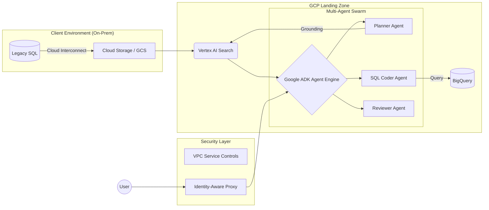

# 🚀 Awesome Forward Deployment Engineering (FDE)

[](https://awesome.re)
[]()
[]()

Forward Deployment Engineering is the art of shipping complex software where it matters most. It is a hybrid role—part **Software Engineer**, part **Data Architect**, and part **Strategic Consultant**. 

FDEs are the "Technical Special Ops" who bridge the gap (The Delta) between a core product and a client’s messy, real-world reality.

---

## 📑 Table of Contents
1. [**The FDE Persona & Mission**](#-the-fde-persona--mission)
2. [**The Master Curriculum**](#-the-master-curriculum)
   - [Phase 1: Data Engineering](#phase-1-data-engineering-the-bedrock)
   - [Phase 2: Cloud Architecture (GCP)](#phase-2-cloud-architecture--infrastructure-the-vehicle)
   - [Phase 3: The Consulting Mindset](#phase-3-the-consulting-mindset-the-forward-in-fde)
3. [**The Applied AI & Technical Playbook**](#-the-applied-ai--technical-playbook)
   - [Multi-Agent Orchestration (ADK)](#-multi-agent-orchestration-with-google-adk)
   - [LLM Systems Evaluation](#%EF%B8%8F-llm-systems-evaluation-the-success-key)
   - [Enterprise RAG Blueprint](#-the-enterprise-rag-blueprint)
4. [**The "Soft Stack": Consulting & Strategy**](#-the-soft-stack-consulting--strategy)
5. [**The Interview Blackbook & Case Studies**](#-the-interview-blackbook--case-studies)
6. [**Artifact Templates (Copy-Paste)**](#-artifact-templates-copy-paste)
7. [**Comprehensive Reading List**](#-comprehensive-reading-list)
8. [**The FDE Glossary**](#-the-fde-glossary)
9. [**Contributing**](#-contributing)

---

## 🛸 The FDE Persona & Mission
The FDE is the **bridge** between the "Perfect Code" of HQ and the "Messy Reality" of the Client.

*   **The Problem:** Standard software often fails when it hits real-world data (corrupt schemas, air-gapped servers, political resistance).
*   **The Solution:** The FDE. They don't just "fix bugs"—they architect solutions, manage stakeholders, and write the "glue code" that makes a multi-million dollar contract successful.

In traditional Software Engineering (SWE), you build for a "user persona". In FDE, you build for a **mission**.

| Feature | Software Engineer (SWE) | Forward Deployed Engineer (FDE) |
| :--- | :--- | :--- |
| **User** | Millions of anonymous users | High-stakes stakeholders (CTOs, Generals, CEOs) |
| **Environment** | Controlled, uniform cloud | Hostile, legacy, air-gapped, or hybrid infra |
| **Goal** | Scale and stability | Speed-to-value and problem-solving |
| **Code Ratio** | 90% Features | 50% Integration/Glue, 50% Strategy |

### 🛠 The Modern FDE Stack

#### Core Tools
*   **Languages:** `Python` (Data/AI), `Go` (Infra), `SQL` (Everything).
*   **Data:** `dbt` (Transformation), `DuckDB` (Local processing), `Apache Spark`.
*   **Cloud:** `Terraform` (IaC), `Helm` (K8s packaging), `GCP`.
*   **Observability:** `Prometheus`, `Grafana`, `Loki`.

---

### 🎓 The Master Curriculum

### Phase 1: Data Engineering (The Bedrock)
*The FDE mission usually starts with a "Data Audit". If you can't untangle a client’s 20-year-old schema, you can't build on top of it.*

*   **Advanced SQL & Query Tuning:** Beyond `JOINs`. You must master Window Functions, Recursive CTEs, and Query Optimization. You should be able to look at an EXPLAIN plan and identify why a query is scanning 10TB of data unnecessarily.
*   **Data Modeling for Reality:** Understand **Star Schema** vs. **One Big Table (OBT)**. Learn to design schemas that balance write-performance with user-readability.
*   **The Medallion Architecture:** 
    *   **Bronze:** Raw landing zone (immutable).
    *   **Silver:** Filtered, joined, and cleaned (the "Single Source of Truth").
    *   **Gold:** Business-ready aggregates (Powering the UI/AI).
*   **Distributed Computing:** Understanding **Spark/Ray** partitioning. You must know how to debug "Data Skew" and "OOM (Out of Memory)" errors when processing client datasets that exceed local memory.
*   **Data Quality & Observability:** Implementing "Circuit Breakers" for data. If a client's upstream data breaks, your pipeline should alert you before the CEO sees a broken dashboard.

#### 📚 Phase 1 Resources
*   **[Select Star SQL](https://selectstarsql.com/):** An interactive book to master SQL through real-world data.
*   **[Designing Data-Intensive Applications (DDIA)](https://www.oreilly.com/library/view/designing-data-intensive-applications/9781491903063/):** The "Bible" for understanding how data systems actually work under the hood.
*   **[dbt Fundamentals](https://courses.getdbt.com/courses/fundamentals):** The standard for turning "Data Engineering" into "Analytics Engineering".
*   **[DuckDB for FDEs](https://duckdb.org/docs/):** A critical tool for fast, local analysis of client CSV/Parquet files without setting up a full cluster.

---

### Phase 2: Cloud Architecture & Infrastructure (The Vehicle)
*FDEs are often "dropped" into complex cloud environments. You must move beyond writing code to architecting the "Landing Zone" where that code lives. Using **GCP** as our standard, you must master how to securely deploy and scale within a client's project.*

*   **Cloud Networking & Security (VPC Mastery):**
    *   **The Global VPC:** Understanding GCP’s unique global networking. Mastering **Shared VPCs** to allow multiple teams to use a single network.
    *   **Secure Connectivity:** Implementing **Cloud Interconnect** or **Cloud VPN** to bridge a client's on-prem data center to GCP.
    *   **Zero-Trust:** Using **Identity-Aware Proxy (IAP)** to grant access to internal apps without a VPN.
*   **Kubernetes as a Standard (GKE):**
    *   **GKE Autopilot vs. Standard:** Knowing when to trade control for operational ease.
    *   **Workload Identity:** The gold standard for security—allowing GKE service accounts to act as IAM service accounts without managing JSON keys.
    *   **Private Clusters:** Deploying GKE without public IP addresses to satisfy strict enterprise security requirements.
*   **Data Architecture on GCP:**
    *   **BigQuery Integration:** Designing schemas for BigQuery (Clustering vs. Partitioning) to handle petabyte-scale analysis for clients.
    *   **Serverless Pipelines:** Using **Cloud Functions** or **Cloud Run** for lightweight, event-driven data processing.
    *   **Pub/Sub:** Architecting real-time streaming "glue" between client systems and your platform.
*   **Data Exfiltration Prevention (VPC Service Controls):**
    *   FDEs in high-security sectors (Finance/Gov) must master **VPC SC**. This defines a security perimeter around Google-managed services to prevent data from being moved to unauthorized projects.
*   **Infrastructure as Code (Terraform):**
    *   Automating the entire "FDE Environment". If you can’t spin up a GKE cluster, a BigQuery dataset, and an IAM policy in 5 minutes via Terraform, you aren't ready to deploy "forward".

#### 📚 Phase 2 Resources (GCP Focused)
*   **[Google Cloud Architecture Framework](https://cloud.google.com/architecture/framework):** The definitive guide to building secure, resilient, and cost-effective systems on GCP.
*   **[GKE Networking Deep Dive](https://cloud.google.com/kubernetes-engine/docs/concepts/network-overview):** Essential reading for understanding how traffic flows inside a cluster.
*   **[Terraform Provider for Google Cloud](https://registry.terraform.io/providers/hashicorp/google/latest/docs):** The documentation you will live in daily.
*   **[Google Cloud "Skills Boost" (Data Engineer Path)](https://www.cloudskillsboost.google/paths/16):** Hands-on labs for BigQuery and Dataflow.
*   **[VPC Service Controls (VPC SC) Explained](https://cloud.google.com/vpc-service-controls/docs/overview):** A critical skill for FDEs working with sensitive enterprise data.
*   **[Google SRE Workbook](https://sre.google/workbook/table-of-contents/):** Specifically the "Monitoring" and "Incident Response" chapters to keep client deployments alive.

---

### Phase 3: The Consulting Mindset (The "Forward" in FDE)
*An FDE is a "Technical Diplomat". You must solve the people problems to allow the technical solutions to work.*

*   **Structured Problem Solving (MECE):** Mutually Exclusive, Collectively Exhaustive. Break a massive "AI Strategy" into small, non-overlapping technical tasks.
*   **The Pyramid Principle:** Start with the answer first. Executives want the "So What?" before the technical "How".
*   **80/20 Value Scoping:** Identify the 20% of features that will solve 80% of the client's pain. Avoid "Gold-Plating" (building complex features no one asked for).
*   **The Art of the Discovery Call:** Learning to ask "Why?" five times to find the root cause of a business problem.
*   **Requirements Translation:** Turning a CEO's "I want more efficiency" into a Jira Ticket for "Optimizing Route Pathfinding Algorithm".

#### 📚 Phase 3 Resources
*   **[The Trusted Advisor](https://trustedadvisor.com/books/the-trusted-advisor):** How to move from being a "vendor" to a "partner".
*   **[The Pyramid Principle (Summary)](https://medium.com/lessons-from-mckinsey/the-pyramid-principle-f0885dd3c5c7):** The gold standard for executive communication.
*   **[How to Win Friends and Influence People](https://www.amazon.com/How-Win-Friends-Influence-People/dp/0671027034):** Sounds cliché, but vital for dealing with resistant IT staff at client sites.
*   **[The McKinsey Way](https://www.amazon.com/McKinsey-Way-Ethan-M-Rasiel/dp/0070534489):** Frameworks for thinking about business problems like an engineer.

---

## 📚 The Applied AI & Technical Playbook

As an FDE, you are the bridge between "State-of-the-Art" research and "Production-Grade" deployment. This section maps the architectures you must master and the Google Cloud tools you will use to ship enterprise-grade value.

### 🏢 Industry Intelligence (The Gold Standard)
Read these to understand how elite teams solve the "messy reality" of enterprise deployment.
*   **[Palantir: Dev vs. Delta](https://blog.palantir.com/dev-versus-delta-demystifying-engineering-roles-at-palantir-ad44c2a6e87)** – The mandatory "Origin Story" of the FDE role.
*   **[OpenAI: Customer Stories](https://openai.com/customer-stories)** – Real-world case studies on deploying GPT-4 into complex workflows (e.g., Morgan Stanley, Harvey).
*   **[Google Cloud: Architecture Blog](https://docs.cloud.google.com/architecture)** – Focus on GKE, BigQuery, and Vertex AI enterprise patterns.
*   **[Anthropic: Evaluating AI Agents](https://www.anthropic.com/engineering/demystifying-evals-for-ai-agents)** – Deep dive into the "Evals" mindset required for production AI.

---

### 🐝 Multi-Agent Orchestration with Google ADK
The **[Agent Development Kit (ADK)](https://github.com/google/adk-docs)** is Google’s open-source, code-first framework for building sophisticated multi-agent systems. It treats agent development like **software engineering**, providing modularity, hierarchy, and deterministic control.

#### ADK Core Primitives
*   **Multi-Agent by Design:** Compose specialized agents in a hierarchy (e.g., a "Manager" delegating to "Researcher" and "Coder" agents).
*   **The Agent2Agent (A2A) Protocol:** An open standard that allows agents to discover and communicate with each other via consistent HTTP-based interfaces.
*   **Model Agnostic:** While optimized for Gemini, ADK uses **LiteLLM** to support GPT-4o, Claude, and Mistral.
*   **Deployment:** Native integration with **[Vertex AI Agent Engine](https://cloud.google.com/vertex-ai/docs/generative-ai/agent-engine/overview)** for managed, auto-scaling production runtimes.

---

### ⚖️ LLM Systems Evaluation (The Success Key)
FDEs don't just "vibes-test" their agents; they use a two-loop evaluation framework to prove reliability to the client.

#### 1. The Inner Loop (Dev-Time Evaluation with ADK)
Focuses on fast, manual, and interactive debugging during development.
*   **`adk eval`:** A CLI and Web UI tool to test execution paths against "Golden Datasets".
*   **Metrics:** `tool_trajectory_avg_score` (Did it use the right tools?), `response_match_score` (ROUGE similarity), and `rubric_based_final_response_quality`.

#### 2. The Outer Loop (Production Evaluation with Vertex AI)
Scalable, automated evaluation for high-volume production data and CI/CD integration. FDEs use this to prove that a model update or a prompt change is a measurable improvement across thousands of test cases.

*   **[Vertex AI Gen AI Evaluation Service](https://cloud.google.com/vertex-ai/docs/generative-ai/models/evaluate-models):** The unified platform for both **Rapid Evaluation** (synchronous, for dev/test) and **Pipeline Evaluation** (asynchronous, for massive datasets).
*   **Pairwise Evaluation (The evolution of AutoSxS):** A "Model-as-a-Judge" approach. It uses a superior model (e.g., Gemini 3 Pro) as an autorater to compare two model responses (Model A vs. Model B) based on a specific rubric, providing win rates and detailed explanations for every "judgment."
*   **Pointwise Evaluation (The RAG Triad):** Assessing single model responses against specific quality dimensions using the **Rapid Eval API**:
    *   **Groundedness:** Does the response strictly follow the retrieved context? (Crucial for eliminating hallucinations).
    *   **Fulfillment:** Did the agent actually follow the instructions in the system prompt?
    *   **Summarization & Coherence:** Evaluating the linguistic quality and density of the output.
*   **[Vertex AI Model Monitoring](https://cloud.google.com/vertex-ai/docs/model-monitoring):** Essential for "Day 2" operations. FDEs set up monitoring to detect **Prediction Drift** and **Feature Attribution** changes in production, ensuring the agentic system doesn't degrade over time as client data evolves.

---

### 🤖 The Enterprise RAG Blueprint
1.  **Ingestion:** Using **[LlamaParse](https://developers.llamaindex.ai/python/framework/llama_cloud/llama_parse/)** to extract data from complex enterprise PDFs/tables.
2.  **Grounding:** Using **[Vertex AI Search](https://docs.cloud.google.com/generative-ai-app-builder/docs)** as a managed RAG engine for semantic retrieval over client data.
3.  **Vector Storage:** High-scale indexing with **[Vertex AI Vector Search](https://docs.cloud.google.com/vertex-ai/docs/vector-search/overview)**.
4.  **Hybrid Search:** Combining semantic vectors with keyword-based BM25 search to satisfy specific industry nomenclature.

---

### 🛠 The FDE Technical Deep-Dives

#### Cloud Architecture (GCP Focused)
*   **[BigQuery Performance Tuning](https://docs.cloud.google.com/bigquery/docs/best-practices-performance-overview):** Master clustering and partitioning for TB-scale client datasets.
*   **[VPC Service Controls (VPC SC)](https://cloud.google.com/vpc-service-controls/docs/overview):** Mandatory for FDEs in Finance/Gov to satisfy data privacy requirements.
*   **[Infrastructure as Code (Terraform)](https://registry.terraform.io/providers/hashicorp/google/latest/docs):** Automating the spin-up of GKE, BigQuery, and Vertex AI environments.

#### Observability & Debugging
*   **[Cloud Trace & Logging](https://cloud.google.com/stackdriver):** Tracking agent latency and debugging failed tool calls in the field.
*   **[LangSmith (Tracing)](https://www.langchain.com/langsmith):** Integrated with ADK to visualize exactly where an agent's "chain of thought" broke.
*   **[The System Design Primer](https://github.com/donnemartin/system-design-primer)** – The ultimate resource for architecting systems that don't crash under client load.

---

### 🚀 Key Resources
*   **[Google ADK Quickstart](https://github.com/google/adk-python)** – Start here to build your first multi-agent team.
*   **[Agent Starter Pack](https://github.com/GoogleCloudPlatform/agent-starter-pack)** – Production-ready templates with built-in CI/CD and evaluation.
*   **[Pinecone: RAG Learning Center](https://www.pinecone.io/learn/series/rag/)** – Best end-to-end RAG education.

---

## 🤝 The "Soft Stack": Consulting & Strategy
*An FDE is a "Technical Diplomat". If you cannot navigate the boardroom, your code will never reach production.*

In the field, you will face **ambiguity**. A CEO might say, *"I want our AI to make us more efficient".* As an FDE, your job is to translate that vagueness into a specific **Technical PRD (Product Requirements Document)**.

### 🧠 The Diagnostic Mindset
When a client asks for a feature, the FDE uses the **"Three Whys"** to find the root business pain:
1.  **"What is the System of Record?"** (Where is the ground truth data? If it's an Excel sheet on someone's desktop, the project is already at risk.)
2.  **"What is the Cost of Inaction?"** (If we don't build this, what happens? This defines the project's priority.)
3.  **"What does 'Day 2' look like?"** (Who maintains this once the FDE leaves? If there is no internal owner, the project will die.)

---

### 📋 The "Forward Deployment" Discovery Checklist
*Before writing a single line of code, you must clear these hurdles:*

#### 🏢 Administrative & Political
- [ ] **The "Champion":** Who is the internal person fighting for this project?
- [ ] **The "Blocker":** Which department (usually IT or Legal) is most likely to stop us?
- [ ] **The Success Metric:** Is success "Lower Latency," "Higher Accuracy," or "Headcount Reduction"?

#### 🔐 Data & Security
- [ ] **Classification:** Is the data PII, PHI, or Secret?
- [ ] **Ingestion:** Is the data "Streaming" (Pub/Sub) or "Batch" (BigQuery transfers)?
- [ ] **Compliance:** Do we need VPC Service Controls or Data Loss Prevention (DLP) masking?

#### 🏗 Infrastructure (The GCP Lens)
- [ ] **Access:** Do we have `Project Editor` or `Owner` roles in the Google Cloud Project?
- [ ] **Connectivity:** Is this a Private GKE cluster? Do we need a Cloud VPN or Interconnect?
- [ ] **Quotas:** Does the client have enough GPU quota (A100/H100) for the models we plan to deploy?

---

### 📐 Strategic Frameworks
*FDEs use these McKinsey-style frameworks to structure technical chaos.*

*   **[The Pyramid Principle](https://medium.com/lessons-from-mckinsey/the-pyramid-principle-f0885dd3c5c7):** **Bottom-Line Up Front (BLUF).** When talking to a CTO, give the conclusion first, then the supporting technical data.
*   **[The MECE Principle](https://en.wikipedia.org/wiki/MECE_principle):** (Mutually Exclusive, Collectively Exhaustive). Ensure your project plan covers all bases without overlapping work.
*   **The Trusted Advisor:** The formula: $Trust = \frac{Credibility + Reliability + Intimacy}{Self-Orientation}$. As an FDE, you must lower your "Self-Orientation" (focusing on the client's win, not your product's features).
*   **The Delta Concept:** Focus entirely on the "Delta"—the specific bridge between what the product does out-of-the-box and what the client needs it to do to be successful.

---

### ✍️ Practical Scoping & Artifacts
*The documents an FDE creates to ensure project survival.*

*   **The SOW (Statement of Work):** This is your shield against "Scope Creep". It defines exactly where your job ends.
*   **The MVA (Minimum Viable Architecture):** Don't over-engineer. Design the simplest version on GCP (e.g., Cloud Run + BigQuery) that proves the value in < 30 days.
*   **The Technical Demo:** An FDE demo is not a feature tour. It is a **Value Narrative**. Show how the data moves from their messy legacy system into a clean AI-driven insight.

### 🚩 Red Flags for FDEs
*If you see these during discovery, escalate immediately:*
1.  **"Data will be ready in 2 weeks".** (It never is.)
2.  **"We don't need a project manager on our side".** (The project will lose direction.)
3.  **"Can we just run this on-prem for now?"** (This usually indicates a deep-seated distrust of Cloud/GCP that will block the project later.)

---

### 🚀 Key Resources for Technical Strategy
*   **[The McKinsey Way](https://www.amazon.com/McKinsey-Way-Ethan-M-Rasiel/dp/0070534489):** Essential for learning "Consultant-speak".
*   **[Good Strategy / Bad Strategy](https://www.amazon.com/Good-Strategy-Bad-Strategy-Difference/dp/0307886239):** Learning to identify the "crux" of a client's problem.
*   **[Architecture Decision Records (ADRs)](https://github.com/joelparkerhenderson/architecture-decision-record):** A critical tool for FDEs to document *why* a certain design choice was made at a client site.

---

## 📝 The Interview Blackbook & Case Studies

FDE interviews at companies like Palantir, Google, or Scale AI don't just test your coding; they test your **"Delta"**—your ability to bridge the gap between a product and a mission.

### 🛠 The "C.A.S.E". Framework for FDE Interviews
When given a case study, do not start coding. Use this four-step diagnostic approach:
1.  **Clarify:** Ask about data volume, security (PII/PHI), and the "Definition of Done".
2.  **Architect:** Design the data flow from source system to end-user UI using GCP primitives.
3.  **Solve (The Delta):** Identify what the product *doesn't* do out of the box and how you will build the "glue".
4.  **Evaluate:** How do we prove the AI isn't hallucinating? How do we monitor performance?

---

### 🏥 The "Delta" Case Study: Hospital Readmission
**Scenario:** *"A massive hospital chain wants to use our software to predict patient readmission. They have 20 years of data in a legacy SQL Server on-prem. They have zero cloud presence and extreme HIPAA privacy concerns. Walk us through your first 30 days".*

#### The "Awesome" Solution (GCP Focused):
*   **Days 1–7 (Discovery & Trust):**
    *   **Technical:** Run a data profiling audit on the SQL Server. Identify key features (age, diagnosis, last visit).
    *   **Strategy:** Meet with the Chief Medical Officer to define "Readmission" (is it 30 days or 90?). Build rapport with the IT team that feels "threatened" by the cloud move.
*   **Days 8–15 (Secure Landing Zone):**
    *   **Architecture:** Propose a **GCP Landing Zone**. Use **Cloud Storage** for ingestion and **BigQuery** for the data warehouse.
    *   **Security:** Implement **VPC Service Controls** and **Sensitive Data Protection (DLP)** to mask PII before it hits the analytics layer. This satisfies the HIPAA requirement.
*   **Days 16–25 (The Agentic Pipeline):**
    *   **Engineering:** Build a pipeline using **Vertex AI Search** grounded in the patient’s history. 
    *   **The Delta:** Write a custom Python service on **Cloud Run** that pulls real-time patient "vitals" from the SQL Server to update the prediction.
*   **Days 26–30 (Value Validation):**
    *   **Evaluation:** Use **AutoSxS** to compare the model's predictions against historical outcomes.
    *   **UAT:** Put a simple dashboard in front of 5 doctors. If they don't change their behavior based on the data, the project has failed.

---

### ⚡ High-Frequency Interview Questions

#### 1. The Data Ingestion Crisis
*   **Question:** "A client has 5PB of data on-prem and needs it in BigQuery in 48 hours for an emergency exercise. How do you do it?"
*   **FDE Answer:** "Internet bandwidth is the bottleneck. I would request a **Google Cloud Transfer Appliance** (high-capacity storage server) to be shipped to the site. While the box is in transit, I’d build the BigQuery schema and partitioning strategy to ensure the data is immediately queryable upon upload".

#### 2. The Hostile Stakeholder
*   **Question:** "The client’s Lead Engineer hates our product and refuses to give you VPC access. How do you handle it?"
*   **FDE Answer:** "This is a trust problem, not a technical one. I’d set up a 1-on-1 to understand their concerns. Often, they fear the product will replace their job. I’d show them how our platform automates the 'grunt work' (ETL/Ops), allowing them to focus on high-level architecture. I’d offer to co-author the initial deployment scripts to give them ownership".

#### 3. Real-Time Latency vs. AI
*   **Question:** "A bank wants real-time fraud detection (<100ms) using an LLM. How do you architect this?"
*   **FDE Answer:** "An LLM is too slow for the primary path. I’d architect a two-tier system: Use a fast, deterministic model (XGBoost/Vertex AI) for the 100ms decision. Then, pass the 'flagged' transactions to a **Gemini-powered agent** via **Vertex AI Reasoning Engine** for an asynchronous, deep-dive explanation that the fraud analyst can read 5 seconds later".

---

### 📖 Real-World Case Studies to Study
*   **[Palantir vs. COVID-19 (UK NHS)](https://www.palantir.com/impact/health-nhs/):** A masterclass in integrating thousands of disparate data sources (beds, staff, PPE) into a single "Operating System" in weeks.
*   **[OpenAI & Morgan Stanley](https://openai.com/customer-stories/morgan-stanley):** How FDEs turned 100,000+ PDFs of financial research into an internal "Assistant" that maintains the bank's strict compliance standards.
*   **[Scale AI & the US Army](https://scale.com/public-sector):** Deploying computer vision models to the "Tactical Edge"—processing satellite and drone data where internet is intermittent.
*   **[Google Cloud & Ford](https://cloud.google.com/customers/ford):** Using GCP to modernize manufacturing and deploy AI across the supply chain.

---

### 🚀 Pro-Tip for the Repo:
Incorporate a **"Case Study Rubric"**—a checklist of what a "Senior" vs. "Junior" answer looks like.
*   *Junior:* Focuses only on the code/Python script.
*   *Senior:* Mentions security, cost-optimization (GCP FinOps), and stakeholder buy-in.

---

## 📂 Artifact Templates (Copy-Paste)

In the field, your documentation is your contract. Use these templates to define reality, manage expectations, and prove value.

### 1. The "Site Survey" (Discovery Report)
*Used in Week 1 to document the "messy reality" before you start building.*

```markdown
### 🕵️ Site Survey: [Client Name] - [Project Name]
**Date:** YYYY-MM-DD | **Lead FDE:** [Your Name]

#### 1. The Data Landscape (The Ground Truth)
- **Source Systems:** [e.g., On-prem SQL Server 2016, SAP HANA, Unstructured Sharepoint]
- **Data Gravity:** [e.g., 5TB total, growing at 50GB/day. Must stay within EU regions.]
- **Known Quality Issues:** [e.g., Missing timestamps in 30% of records, no primary keys in CRM.]

#### 2. Technical & Security Constraints
- **Identity:** [e.g., Client uses Okta for OIDC. Need to integrate with GCP IAM.]
- **Connectivity:** [e.g., No public internet. Must use Cloud Interconnect + Private Google Access.]
- **Exfiltration Risks:** VPC Service Controls (VPC SC) are active. Need to request perimeter bridges.

#### 3. The "Delta" (The Gap)
- **Product Gap:** Core product doesn't support the client's proprietary `.xyz` file format.
- **Proposed Glue:** Build a custom GCF (Cloud Function) parser to convert `.xyz` to Parquet.

#### 4. The Quick Win (Week 2 Objective)
- [e.g., Stand up a Vertex AI Search instance on the 'Policy' dataset to prove 90% retrieval accuracy.]
```

---

### 2. The Technical Scoping & PRD
*The "Contract" that defines what success looks like.*

```markdown
### 📐 Technical Scoping Document: [Feature Name]

#### 1. Objective & User Persona
Enable **[User Group, e.g., Risk Analysts]** to perform **[Action, e.g., Fraud Investigation]** by leveraging **[Technology, e.g., Multi-Agent ADK Swarm]**.

#### 2. Definition of Success (The Evals)
*Success is not "it works"; success is measurable:*
- **Retrieval:** >90% Hit Rate on Top-3 documents.
- **Latency:** End-to-end agent reasoning < 5 seconds.
- **Groundedness:** 0% Hallucination rate on Golden Dataset (manually verified by Client).

#### 3. Phased Deployment Strategy
- **Phase 1 (MVP):** Manual trigger agent on Cloud Run using BigQuery static export.
- **Phase 2 (Scale):** Automated trigger via Pub/Sub on real-time data stream.

#### 4. Out of Scope
- Integration with the legacy AS400 mainframe (deferred to Q3).
```

---

### 3. The Agentic Deployment Architecture (GCP)
*A Mermaid/Excalidraw diagram showing a modern, high-scale FDE deployment.*



---

### 4. The Executive Status Report (The "WES")
*The weekly document that justifies the contract renewal.*

```markdown
## 🛰️ Weekly Executive Summary: [Project Name]
**Reporting Period:** [Date Range] | **Status:** 🟢 GREEN

#### 🚀 Value Delivered This Week
- **Metric Move:** Reduced manual data lookup time for Analysts by **40%** via the new Search Agent.
- **Milestone:** Successfully cleared the Security Review for the GKE Private Cluster.
- **Ingestion:** 1.2B rows of historical logs moved into BigQuery; partitioning optimized for cost.

#### ⚠️ Risks & Strategic Blockers
- **Risk:** Client IT team has delayed the Firewall port opening for the VPN.
- **Impact:** Potential 3-day slide on the "Real-time" dashboard milestone.
- **Action Required:** Need [Executive Sponsor Name] to approve the exception ticket #12345.

#### 🗓️ The "Day 30" Horizon
- Finalize **AutoSxS** evaluation for the production agent.
- Transition 1st-line support to the internal Client Ops team.
```

---

## 📖 Comprehensive Reading List

Being a "Forward" engineer means staying six months ahead of the industry. This list is curated to move you from a "coder" to a "system architect and strategist".

### 📚 The FDE "Canon" (Core Books)
*   📗 **[Designing Data-Intensive Applications](https://www.oreilly.com/library/view/designing-data-intensive-applications/9781491903063/) (Martin Kleppmann):** The "Bible". If you only read one book on this list, make it this one. It explains the *why* behind every database and distributed system you will use on GCP.
*   📘 **[The Trusted Advisor](https://trustedadvisor.com/books/the-trusted-advisor) (David Maister):** FDEs fail more often due to broken trust than broken code. This book teaches you how to move from a "vendor" to a "strategic partner".
*   📙 **[The Pyramid Principle](https://www.amazon.com/Pyramid-Principle-Logic-Writing-Thinking/dp/0273710516) (Barbara Minto):** The McKinsey standard for communication. Learn to lead with the conclusion and support it with data—essential for talking to client executives.
*   📕 **[Enterprise Integration Patterns](https://www.enterpriseintegrationpatterns.com/) (Gregor Hohpe):** Essential for Phase 2. It teaches you how to "glue" legacy systems together using messaging, gateways, and translators.
*   📓 **[Staff Engineer: Leadership beyond the management track](https://staffeng.com/book) (Will Larson):** FDE is often a "Staff-plus" role in terms of scope. This book helps you navigate the high-level technical leadership required at client sites.

---

### 📄 The Fundamental Whitepapers
*FDEs should understand the "ancestry" of the GCP tools they use.*
*   **[The Google File System (2003)](https://research.google.com/archive/gfs-sosp2003.pdf):** The ancestor of GCS (Google Cloud Storage).
*   **[Bigtable: A Distributed Storage System for Structured Data (2006)](https://research.google.com/archive/bigtable-osdi06.pdf):** The foundation of NoSQL on GCP.
*   **[Attention Is All You Need (2017)](https://arxiv.org/abs/1706.03762):** The paper that started the Transformer/LLM revolution.
*   **[ReAct: Synergizing Reasoning and Acting in Language Models (2023)](https://arxiv.org/abs/2210.03629):** The logic behind how Agentic systems (like Google ADK) actually work.

---

### 🎙 Podcasts: Learning on the Go
*   🎙 **[Latent Space](https://www.latentspace.ai/):** The best podcast for the "AI Engineer" era. Deep dives into RAG, Agents, and Evals.
*   🎙 **[The Cognitive Revolution](https://www.cognitiverevolution.ai/):** Interviews with the people actually building the frontier models you will be deploying.
*   🎙 **[Software Engineering Daily](https://softwareengineeringdaily.com/):** Search their archives for "GCP," "Palantir," or "Distributed Systems".
*   🎙 **[The Data Engineering Podcast](https://www.dataengineeringpodcast.com/):** Vital for staying updated on the "Modern Data Stack".

---

### 📧 Newsletters: The Daily Pulse
*   📧 **[Import AI (Jack Clark)](https://jack-clark.net/):** A weekly summary of AI progress and—crucially—AI policy/safety.
*   📧 **[GCP Weekly](https://www.gcpweekly.com/):** A non-official but highly curated list of every update in the Google Cloud ecosystem.
*   📧 **[Interconnects (Nathan Lambert)](https://www.interconnects.ai/):** Deep technical analysis of LLM training and alignment.
*   📧 **[The Pragmatic Engineer](https://blog.pragmaticengineer.com/):** Insights into how big tech companies actually operate and ship software.

---

### 🌐 High-Signal Blogs
*   **[The Morning Paper (Archive)](https://blog.acolyer.org/):** A fantastic archive of CS paper summaries.
*   **[Google Cloud "Architecture" Blog](https://cloud.google.com/blog/products/gcp):** Look specifically for "Reference Architectures".
*   **[Eugene Yan’s Blog](https://eugeneyan.com/):** Incredible deep dives on building production-grade ML and Recommendation systems.

---

## 📖 The FDE Glossary

### 🛸 Foundational Concepts (The "Forward" in FDE)
*   **The Delta:** Pioneered by Palantir, this refers to the "gap" between what a product does out-of-the-box and the specific engineering required to make it solve a client's mission.
*   **Productized Consulting:** The philosophy of solving a client’s unique problem through code that can eventually be abstracted back into the core product features.
*   **Embedded Engineering:** Unlike a consultant who "advises," an FDE is embedded—they have client credentials, sit in client Slack channels, and ship code directly into the client’s production environment.
*   **Last-Mile Integration:** The complex work of stitching a modern SaaS/AI platform into legacy, often undocumented, "messy" enterprise systems.

### 🏗 The Technical & Infra Stack (GCP & Beyond)
*   **Air-Gap / Tactical Edge:** Environments with zero or intermittent internet connectivity (Common in Defense/Energy). Requires local container registries and offline model weights.
*   **VPC Service Controls (VPC SC):** A GCP security perimeter that prevents data exfiltration by restricting access to Google-managed services (like BigQuery or Vertex AI) only from authorized networks.
*   **Hardening:** The process of moving a prototype from "it works on my machine" to "it meets SOC2/HIPAA security standards," including encryption at rest/transit and least-privilege IAM roles.
*   **Shadow IT:** Unauthorized tools or "rogue" databases used by client employees. This is often where the "cleanest" and most useful data actually lives.
*   **System of Record (SoR):** The authoritative data source for a given piece of information (e.g., SAP for finance, Salesforce for CRM). FDEs must identify this to avoid building on "stale" data replicas.

### 🤖 The AI & Agentic Layer (ADK & Evals)
*   **Agent2Agent (A2A) Protocol:** An open standard used in the **Google Agent Development Kit (ADK)** that allows autonomous agents to discover, hand off tasks, and communicate with one another across systems.
*   **Workflow Agents:** Deterministic agents in ADK (`SequentialAgent`, `ParallelAgent`, `LoopAgent`) that follow fixed logic paths rather than relying on an LLM to "plan" the next step.
*   **Grounding:** The process of connecting an LLM to "Ground Truth" data (via RAG or Google Search) to ensure its responses are factual and cite-able.
*   **AutoSxS (Side-by-Side):** A GCP-native evaluation method where an "Autorater" LLM compares two model outputs and provides a structured judgment on which is better and why.
*   **Faithfulness (RAGAS Metric):** A measure of how much the answer is derived *only* from the retrieved context, essentially a "hallucination score".

### 🤝 Strategic Consulting (Boardroom Language)
*   **SOW (Statement of Work):** The legally binding "fence" around your project. If it’s not in the SOW, it’s "Scope Creep".
*   **MSA (Master Services Agreement):** The high-level contract between your company and the client that defines the legal relationship before any specific work starts.
*   **Cost of Inaction (CoI):** A strategic argument used to drive projects forward by quantifying how much money/efficiency the client loses every day they *don't* deploy the solution.
*   **UAT (User Acceptance Testing):** The "moment of truth" where actual client employees use the tool. If they don't "accept" it, the project isn't done, regardless of how good the code is.
*   **Day 2 Operations:** Everything that happens after the FDE leaves. Includes monitoring, retraining models, and training the client's internal "Run Team".

---

## 🤝 Contributing
Found a resource that changed your FDE career? 
1. Open a PR.
2. Ensure the link is high-quality and free (or worth the cost).
3. Add a 1-sentence description of *why* it matters for FDEs.

### 🚀 "The FDE's goal is to become obsolete at a client site—because the system you built is so good, it runs itself".
